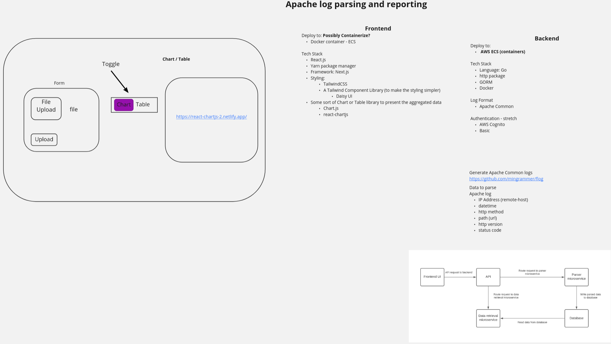

# apache-log-parser

A microservice based full stack application to parse Apache Common Log files and aggregate the data for display in charts and tables.

The goal is to deploy to AWS ECS.

#### Running

`docker compose up`

An example Apache log can be generated by following the default instructions from [this](https://github.com/mingrammer/flog) log generator.
Which can then be uploaded to the backend to be parsed and stored either from the frontend or just with an http client like Postman.

Ports:

- web: `3000`
- database (**PostreSQL**): `5432`
- registry service: `4000`
- log service: `4001`
- parser service: `4002`
- data retrieval service: `4003`

##### PostgreSQL Domain Model

- `remote_host`: text
- `date_time`: timestamp with timezone
- `method`: text
- `route`: text
- `status`: bigint
- `http_version`: bigint

##### Still left TODO (probably in order):

- [x] Figure out connection to Postgres container from the other container services (env var issues / flaky)
- [ ] Deploy to ECS with CI/CD
- [x] Setup breakpoints in Tailwind for different screen sizes
- [ ] Add authentication. Try AWS Cognito
- [x] Aggregate more data into the below chart. Currently it is only rendering the count of methods,
  however all the other data is ready to be displayed as well, just needs to be hooked up to the chart.
    - counts of status codes, http versions, etc.
- [ ] Aggregate the data on the backend instead of the frontend to reduce traffic being sent
- [ ] Add tests for the backend
- [ ] Also render a table view of the same data

#### Current look

#### Wireframe

